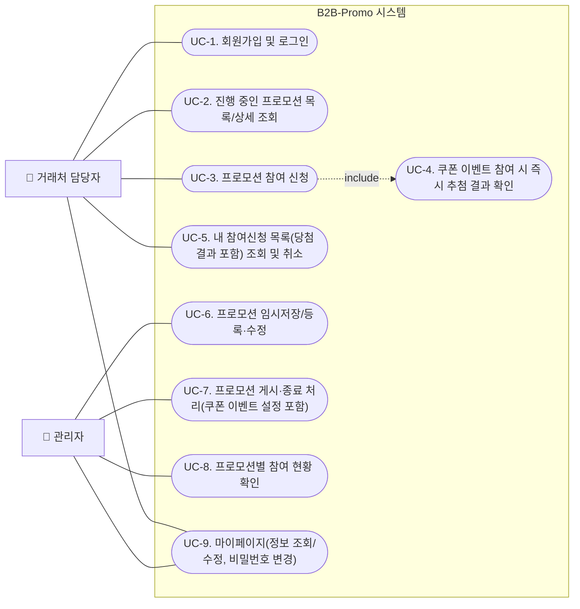

# 유스케이스 다이어그램 - B2B-Promo

## 변경 이력
| 버전 | 날짜/시간 | 변경 내용 |
|---|---|---|
| v1.0 | 2026-08-13 | 최초 작성 |
| v1.1 | 2026-08-13 | 도메인 정의서 v1.2~v1.3 개정 반영: UC-4/5/7 라벨 최신화, 관리자-UC1 잘못된 연결 제거 |
| v1.2 | 2026-08-13 | docs 정합성 교차 검토 결과 반영: UC-9 라벨에 누락된 "조회" 보완 |

> 출처: [1-domain-definition.md](./1-domain-definition.md) 4장(액터), 유스케이스(UC-1~9) — v1.5 기준 동기화

- 점선(`-. include .->`): UC-3(참여 신청) 수행 중, 대상 프로모션에 쿠폰 이벤트가 붙어있으면 UC-4(추첨 결과 확인)가 포함되어 실행됨(BR-4, BR-5).
- UC-9는 거래처 담당자·관리자 공통 유스케이스.
- UC-1(회원가입 및 로그인)은 도메인 정의서상 거래처 담당자 전용 유스케이스다. 관리자 로그인은 BR-1(로그인 필수)의 적용 대상이지만 별도 유스케이스로 정의되어 있지 않아 이 다이어그램에서는 표현하지 않는다.
