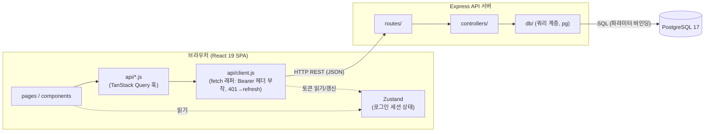
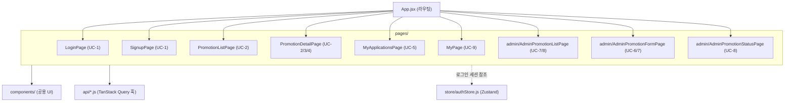
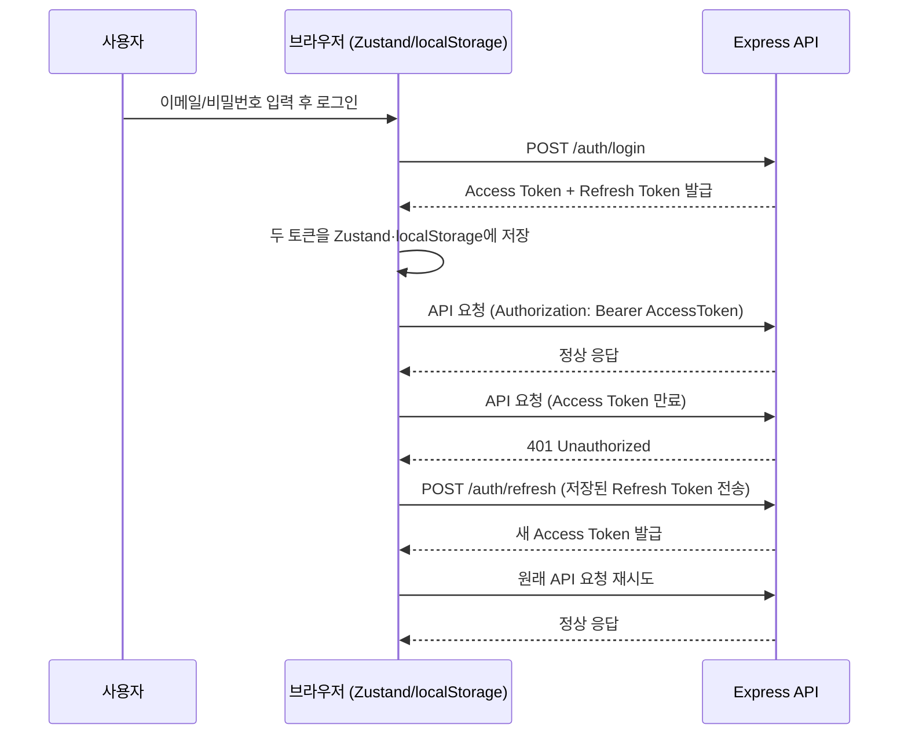

# 기술 아키텍처 다이어그램 - B2B-Promo

## 변경 이력
| 버전 | 날짜/시간 | 변경 내용 |
|---|---|---|
| v1.0 | 2026-08-13 | 최초 작성 |
| v1.1 | 2026-08-13 | 프론트엔드 컴포넌트 구조 다이어그램 추가 |

> 본 문서는 `docs/1-domain-definition.md`(v1.5), `docs/3-prd.md`(v1.4), `docs/5-project-principle.md`(v1.0)를 기반으로 작성되었다. PRD v1.4에 따라 Access/Refresh 토큰은 모두 클라이언트 측(Zustand/localStorage)에 저장하며 httpOnly 쿠키는 사용하지 않는다. 로드밸런서·캐시서버·메시지큐·CDN·모니터링 등 이번 MVP 범위에 없는 인프라는 다이어그램에 포함하지 않는다.

---

## 1. 전체 시스템 구성도

- 프론트: 화면(pages/components)은 서버 데이터를 TanStack Query 훅으로만 가져오고, Zustand는 로그인 세션(토큰·사용자 정보)만 별도로 관리한다(`5-project-principle.md` 2.1절).
- 백엔드: routes → controllers → db(쿼리 계층) 3단 구조로만 흐르며, 컨트롤러가 비즈니스 로직 계층을 겸한다(서비스 레이어 없음).
- ORM 없이 `db/`에서 `pg`로 파라미터화된 SQL을 PostgreSQL에 직접 실행한다.

---

## 2. 프론트엔드 컴포넌트 구조

- `App.jsx`가 라우팅으로 각 page를 연결하고, page들은 공용 `components/`를 재사용한다(`5-project-principle.md` 6절과 동일 구조).
- 서버 데이터(프로모션/신청 목록 등)는 모든 page가 `api/*.js`(TanStack Query 훅)로만 가져온다.
- `store/authStore.js`(Zustand)는 로그인 세션만 참조하며 서버 데이터는 담지 않는다.

---

## 3. 인증 흐름

- Access/Refresh 토큰 모두 클라이언트(Zustand + localStorage 영속화)에 저장하며 httpOnly 쿠키는 사용하지 않는다(PRD v1.4).
- Access Token 만료(401) 시에만 `/auth/refresh`를 호출해 Refresh Token으로 재발급받고, 원 요청을 재시도한다.
- Refresh Token은 서명 검증만 하는 stateless 방식이라 서버에 별도 저장소가 없다.
  - ponytail: 두 토큰이 모두 JS 접근 가능한 저장소에 있어 XSS 시 탈취 위험이 크다. 교육용 MVP 범위에서 감수하며, 실서비스 전환 시 Refresh Token을 httpOnly 쿠키로 승격한다(PRD 6.3절과 동일).
