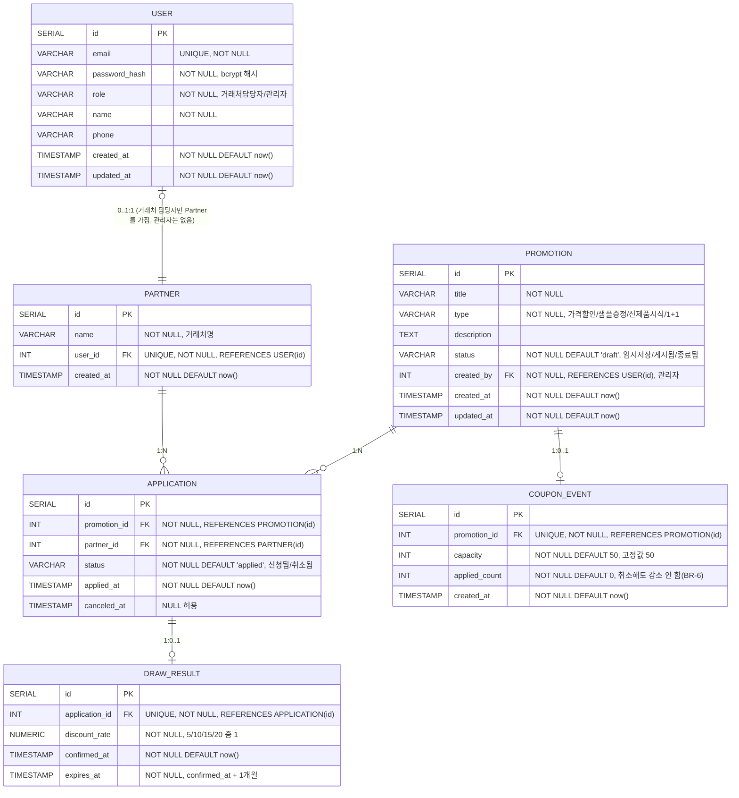

# ERD - B2B-Promo

## 변경 이력
| 버전 | 날짜/시간 | 변경 내용 |
|---|---|---|
| v1.0 | 2026-08-13 | 최초 작성 |
| v1.1 | 2026-08-13 | docs 정합성 교차 검토 결과 반영: USER-PARTNER 카디널리티 오류 수정(관리자는 Partner를 갖지 않으므로 User 쪽을 0..1로 정정), status 필드에 DEFAULT 값 명시(스키마와 동기화), 원자 증가 쿼리 예시에 RETURNING 절 추가(다른 문서와 표현 통일), PRD 참조 버전을 v1.5로 갱신 |

> 본 문서는 `docs/1-domain-definition.md`(v1.5) 2절/2-1절/3절/5절(BR-1~11)과 `docs/3-prd.md`(v1.5) 7절(PostgreSQL 17, ORM 없이 `pg` 직접 사용)을 기반으로 작성되었다. 이번 MVP에 없는 인덱스 설계·파티셔닝·읽기 복제본 등은 다루지 않는다.

---

## ERD

---

## 핵심 제약 설명

- **USER - PARTNER (1:1)**: `partner.user_id`에 `UNIQUE` + `FK`를 걸어 계정당 거래처 1곳으로 단순화한다(알려진 제약: 같은 회사 담당자가 여러 명 가입하면 각각 별도 Partner로 취급됨).
- **PROMOTION - COUPON_EVENT (1:0..1)**: `coupon_event.promotion_id`에 `UNIQUE` + `FK`로 프로모션당 쿠폰 이벤트 최대 1개를 보장한다.
- **PROMOTION - APPLICATION (1:N), PARTNER - APPLICATION (1:N)**: `application(promotion_id, partner_id)` 조합에 복합 `UNIQUE` 제약을 걸어 BR-3("(프로모션, 거래처) 조합당 1건")을 DB 레벨로 보장한다. 취소·재신청은 새 행을 만들지 않고 같은 행의 `status`/`canceled_at`을 갱신하는 방식으로 처리한다(신청됨 ↔ 취소됨).
- **COUPON_EVENT.applied_count (BR-6, BR-7)**: 신청 성공 시 `UPDATE coupon_events SET applied_count = applied_count + 1 WHERE id = $1 AND applied_count < capacity RETURNING applied_count` 형태의 조건부 원자 증가로 갱신하며(PRD 6.2절), 영향받은 행이 0건이면 마감으로 판단해 신청을 거부한다. 취소돼도 `applied_count`는 감소하지 않는다(슬롯 미반환).
  - ponytail: 단일 행 잠금 기반 단순 구현. 경합이 병목이 되면 큐 기반으로 승격.
- **APPLICATION - DRAW_RESULT (1:0..1, BR-5)**: `draw_result.application_id`에 `UNIQUE` + `FK`로 참여신청당 추첨결과 최대 1건을 보장한다. 재신청 시 새 추첨 결과를 `INSERT ... ON CONFLICT (application_id) DO UPDATE`(upsert)로 같은 행에 덮어쓰며, 별도 이력/무효화 상태는 두지 않는다.
- **PROMOTION.status / APPLICATION.status**: 애플리케이션 레벨에서 관리하는 상태값이며, 별도 상태 코드 테이블이나 ENUM 타입 없이 `VARCHAR`로 단순화한다(과도한 정규화 방지).
  - ponytail: 상태값 종류가 적고 고정적이라 조회용 코드 테이블은 두지 않음. 상태 종류가 늘어나면 CHECK 제약 또는 ENUM 타입으로 승격 검토.
