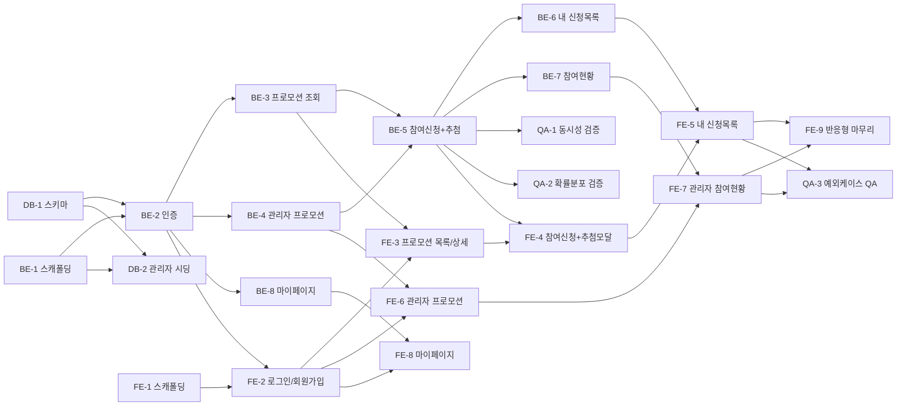

# 실행 계획 - B2B-Promo

## 변경 이력
| 버전 | 날짜/시간 | 변경 내용 |
|---|---|---|
| v1.0 | 2026-08-13 | 최초 작성 |
| v1.1 | 2026-08-13 | docs 정합성 교차 검토 결과 반영: 헤더 기반 문서 목록에 누락된 `4-user-scenario.md`(v1.1) 추가, BE-4/FE-6 관련 문서에 BR-10 보완, BE-5 관련 문서에 BR-11 보완, 0.3절 의존 관계 다이어그램에 누락된 BE-8→FE-8 엣지 추가 |
| v1.2 | 2026-08-13 | DB-1 수행 완료: `b2b_promo` 생성, `backend/migrations/001_init.sql` 실행 및 7개 완료 조건 실측 검증(테이블 6개, BR-3/BR-5 UNIQUE, BR-6 CHECK, BR-8 GENERATED 컬럼 계산) 후 체크박스 반영 |
| v1.3 | 2026-08-13 | DB-2 수행 완료: `backend/scripts/seedAdmin.js` 작성(ON CONFLICT DO NOTHING 방식), 4개 완료 조건 실측 검증(role=admin, bcrypt 해시, 재실행 시 중복 없음, partners 행 미생성) 후 체크박스 반영. 시딩 스크립트 실행에 필요한 최소 패키지(pg/bcrypt/dotenv)만 설치했으며 Express 등 전체 스캐폴딩(BE-1)은 별도 수행 필요, `.env`의 접속 DB를 `b2b_promo`로 갱신 |
| v1.4 | 2026-08-13 | BE-1 수행 완료: `express`/`jsonwebtoken`/`cors` 추가 설치, `src/app.js`(Express 앱, 헬스체크 `GET /`·에러 유발용 임시 라우트 `GET /__throw`, CORS는 `FRONTEND_ORIGIN` 단일 origin만 허용) / `src/server.js`(리스닝 전담) / `src/db/pool.js`(raw `pg.Pool`) / `src/middlewares/errorHandler.js` 작성. `.env`에 `PORT`, `FRONTEND_ORIGIN` 추가(`.gitignore`로 이미 커밋 제외 확인). 이번 세션에서 프로젝트 원칙(5-project-principle.md 4절, 테스트 프레임워크 미도입)을 사용자가 명시적으로 override하여 Jest+supertest 테스트 스위트(`backend/tests/*.test.js`)를 도입, `src/**/*.js` 기준 문(statement)/라인/함수/분기 커버리지 100% 달성(11개 테스트 통과) 후 6개 완료 조건을 실측 검증(서버 기동·200 응답·SELECT 1 연결·`.env` 미커밋·errorHandler JSON 에러 응답·ORM 미사용)하고 체크박스 반영 |
| v1.5 | 2026-08-20 | BE-2 수행 완료: `src/db/users.queries.js`(findByEmail/insertUser·role 항상 'partner' 고정/insertPartner), `src/controllers/auth.controller.js`(signup은 pool.connect() 트랜잭션으로 User+Partner 동시 생성 후 이메일 중복(23505)→409, login은 bcrypt.compare 후 Access(15m)/Refresh(7d) JWT 동시 발급, refresh는 jwt.verify로 stateless 검증) + `src/routes/auth.routes.js`, `src/middlewares/auth.js`(Bearer 토큰 검증, admin 체크는 BE-4에서 컨트롤러가 처리하도록 위임) 작성. `src/app.js`에 `/auth` 라우트 연결하고 BE-1의 임시 라우트 `GET /__throw` 제거(테스트도 함께 정리). `.env`에 `JWT_ACCESS_SECRET`/`JWT_REFRESH_SECRET` 추가. `backend/tests/auth.test.js` 신규 작성(`test-auth-%` 이메일 패턴으로만 정리해 DB-2 시딩 관리자 계정 보존), 총 25개 테스트 통과, 커버리지 문 98%/라인 97.97%/분기 87.5%/함수 100%(잔여 미커버 분기는 방어적 generic catch 2곳). 9개 완료 조건을 실측 검증 후 체크박스 반영 |
| v1.6 | 2026-08-20 | BE-3 수행 완료: `src/db/promotions.queries.js`(`listPublished()`는 `status='published'`만 조회(BR-9/BR-10), `findById(id)`는 status 제한 없이 조회, `LEFT JOIN coupon_events` 결과를 `mapRow()`로 `{...promotion, coupon_event}` 중첩 객체로 매핑, 없으면 `coupon_event: null`) + `src/controllers/promotions.controller.js`(`list`, `getById` — 비정수 `:id`는 pg 캐스팅 500 대신 즉시 404) + `src/routes/promotions.routes.js`(전체 라우트에 기존 인증 미들웨어 적용) 신규 작성. `src/app.js`에 `/promotions` 라우트 연결. `backend/tests/promotions.test.js` 신규 작성(BE-4 관리자 등록 API가 아직 없어 fixture는 테스트 내에서 pool.query로 직접 INSERT, `test-promo-%` 이메일 패턴으로만 계정 정리), 총 35개 테스트 통과, 커버리지 문 97.01%/라인 96.99%/분기 89.58%/함수 100%. 6개 완료 조건을 실측 검증 후 체크박스 반영 |
| v1.7 | 2026-08-20 | 이 세션부터 백엔드 테스트는 사용자가 미리 구동해둔 개발 서버(`npm run dev`, nodemon, `PORT=3000`)를 대상으로 HTTP 요청(supertest에 base URL 문자열 전달)을 보내는 방식으로 전환(기존 in-process `require(app)` 방식 폐기). `tests/app.test.js`/`auth.test.js`/`promotions.test.js`를 이 방식으로 갱신. 이에 따라 Jest 커버리지 리포트는 서버 프로세스에서 실행되는 라우트/컨트롤러/쿼리 모듈을 더 이상 계측하지 못함(테스트 프로세스에서 직접 require하는 모듈만 집계) — 이후 태스크의 "커버리지 90%+"는 계측치 대신 완료조건 매핑 기준 테스트 시나리오 커버리지로 검증 |
| v1.8 | 2026-08-20 | BE-4 수행 완료: `src/db/couponEvents.queries.js`(`insertCouponEvent` — capacity는 DB DEFAULT 50 사용, BR-6) 신규, `src/db/promotions.queries.js`에 `listAll`/`insertPromotion`/`updatePromotion`/`updateStatus` 추가, `src/controllers/promotions.controller.js`에 `requireAdmin` 헬퍼(별도 미들웨어 없이 컨트롤러 조건문) + `adminList`/`adminCreate`(트랜잭션으로 promotion+coupon_event 동시 생성)/`adminUpdate`/`adminUpdateStatus`(status 화이트리스트 published/closed) 추가, `src/routes/promotions.routes.js`가 `{router, adminRouter}` 객체로 export하도록 변경. `src/app.js`에 `/admin/promotions` 라우트 연결. `backend/tests/adminPromotions.test.js` 신규 작성(관리자 로그인은 DB-2 시딩 계정 재사용, `test-adminpromo-%` 패턴으로만 정리, 생성한 promotion/coupon_event id만 정확히 삭제), 총 51개 테스트 통과(v1.7 방침에 따라 실행 중인 서버 대상). 7개 완료 조건을 실측 검증 후 체크박스 반영 |
| v1.9 | 2026-08-20 | BE-5 수행 완료(⭐ 최고 난이도): `src/db/applications.queries.js`(신규, 조회/삽입/재활성화/취소), `src/db/drawResults.queries.js`(신규, `drawDiscountRate()` 순수함수(BR-4 확률분포)와 `upsertDrawResult`(`ON CONFLICT (application_id) DO UPDATE`, BR-5)), `src/db/users.queries.js`에 `findPartnerIdByUserId` 추가, `src/controllers/applications.controller.js`(신규) `apply`(promotion 조회 후 closed면 409, 단일 트랜잭션 내에서 중복 신청 확인→조건부 원자 증가 `UPDATE coupon_events SET applied_count=applied_count+1 WHERE id=$1 AND applied_count<capacity RETURNING ...`(BR-6/BR-7, TOCTOU 방지)→신청 upsert→쿠폰 있으면 추첨+draw_results upsert→COMMIT, 마감/중복 시 ROLLBACK으로 흔적 없음)/`cancel`(소유권 검증 403, 프로모션 상태 무관 취소 허용 BR-11, applied_count 미조정). `src/routes/applications.routes.js` 신규, `src/app.js`에 연결. **구현 중 발견한 버그 수정**: 라우터를 app 루트에 마운트하면서 `router.use(auth)`로 전체를 감쌌더니 이 라우터가 처리하지 않는 경로(예: 존재하지 않는 라우트)까지 auth가 가로채 404 대신 401을 반환하는 문제 발견 → 라우트별 `auth` 개별 적용으로 수정(회귀 테스트 `app.test.js`가 이 문제를 포착함). `backend/tests/applications.test.js` 신규 작성(50명 마감 조건은 `applied_count`를 직접 49로 세팅해 결정적으로 재현, `test-be5-%` 패턴으로만 계정 정리, FK 순서대로 draw_results→applications→coupon_events→promotions 정리), 총 66개 테스트 통과. 13개 완료 조건을 실측 검증 후 체크박스 반영 |
| v1.10 | 2026-08-20 | BE-6 수행 완료: `src/db/applications.queries.js`에 `findByPartnerId(partnerId)` 추가, `src/controllers/applications.controller.js`에 `myApplications` 추가(새 JOIN 설계 없이 기존 `promotions.queries.findById`/`drawResults.queries.findByApplicationId`를 N+1로 재사용해 `{...application, promotion, draw_result}` 조립 — MVP 데이터 규모상 가장 단순한 선택, 파트너 없는 토큰은 빈 배열 200 응답), `src/routes/applications.routes.js`에 `GET /applications/me`를 기존 라우트별 `auth` 개별 적용 패턴으로 추가(`router.use(auth)` 재도입 안 함). `backend/tests/applications-me.test.js` 신규 작성(파트너 A/B 2계정, 일반/쿠폰당첨/취소/종료후유지 4개 프로모션 시나리오, `test-be6-%` 패턴으로만 정리), 총 72개 테스트 통과. 5개 완료 조건을 실측 검증 후 체크박스 반영 |
| v1.11 | 2026-08-20 | BE-7 수행 완료: `src/db/applications.queries.js`에 `countByStatus`/`discountDistribution`/`listByPromotion` 3개 집계 쿼리 추가, `src/controllers/promotions.controller.js`에 기존 `requireAdmin` 재사용한 `adminApplicationsSummary` 추가(병렬 쿼리 조회 후 상태별 건수/할인율 분포/신청 거래처 목록 조립), `src/routes/promotions.routes.js`의 기존 `adminRouter`에 `GET /:id/applications` 추가. **구현 검토 중 발견한 버그 수정**: `draw_results.discount_rate`가 `NUMERIC(5,2)` 컬럼이라 `pg`가 기본적으로 문자열("5.00")로 반환하는데, 이를 캐스팅 없이 `discount_distribution`의 정수 키(5/10/15/20)에 그대로 대입하면 매칭되지 않고 별도 문자열 키가 생겨 분포가 전부 0으로 보이는 문제 발견 → 두 쿼리 모두 `discount_rate::int`로 캐스팅해 수정(BE-5 응답에서는 컨트롤러가 `Number()`로 방어하고 있었으나 BE-7 신규 쿼리에는 없었음). `backend/tests/adminApplicationsSummary.test.js` 신규 작성(쿠폰 이벤트 프로모션에 파트너 A/B/C 신청 후 C 취소, 일반 프로모션에 D 신청, `test-be7-%` 패턴으로만 정리), 총 81개 테스트 통과. 5개 완료 조건을 실측 검증 후 체크박스 반영 |
| v1.12 | 2026-08-20 | BE-8 수행 완료: `src/db/users.queries.js`에 `findById`/`updateProfile`/`updatePassword` 추가, `src/controllers/users.controller.js`(신규) `getMe`(기존 login의 password_hash 제외 destructuring 패턴 재사용)/`updateMe`/`changePassword`(현재 비밀번호 bcrypt.compare 실패 시 400, 8자 미만 신규 비밀번호 400), `src/routes/users.routes.js`(신규, `/users` prefix로 좁게 마운트되어 `router.use(auth)` 전체 적용이 안전 — applications.routes.js처럼 앱 루트에 마운트되는 경우와 다름). `src/app.js`에 `/users` 라우트 연결. `backend/tests/users.test.js` 신규 작성(`test-users-%` 패턴으로만 정리), 총 89개 테스트 통과. **테스트 인프라 수정**: 전체 스위트를 Jest 기본(병렬 워커)으로 실행하면 여러 테스트 파일이 동시에 같은 하나의 실행 중인 개발 서버(v1.7 방침)를 두들겨 `beforeAll` 훅이 5초 타임아웃을 넘겨 실패하는 현상 발견(개별 실행 시엔 통과) → `package.json`의 `test` 스크립트를 `jest --runInBand`로 변경해 테스트 파일을 직렬 실행하도록 수정, 이후 89개 전부 통과 재확인. 4개 완료 조건을 실측 검증 후 체크박스 반영 |
| v1.13 | 2026-08-20 | FE-1 수행 완료: `npm create vite@latest frontend -- --template react`로 React 19 스캐폴딩(`zustand`/`@tanstack/react-query`/`react-router-dom` 설치), `5-project-principle.md` 6절 구조로 `src/pages/`, `src/pages/admin/`, `src/components/`, `src/api/`, `src/store/` 생성. `src/store/authStore.js`(Zustand+`persist`, `auth-storage` 키로 localStorage 영속화, 토큰/사용자 정보만 보관). `src/api/client.js`(`apiFetch` — Authorization 헤더 부착, 401 시 `/auth/refresh` 1회 재시도 후 실패하면 logout+`/login` 리다이렉트; refresh token은 회전하지 않음, swagger.json 기준). `src/App.jsx`(`BrowserRouter`+`ProtectedRoute`+`QueryClientProvider`), `src/pages/LoginPage.jsx`/`HomePage.jsx`(FE-2에서 교체될 placeholder). `src/styles/tokens.css`(`10-style.md` 1~4절 토큰). Vitest+React Testing Library 도입(`test:"vitest run"`, 새 의존성은 이 조합으로 한정), 테스트 13개 작성(authStore 4/client.js 6/App·ProtectedRoute 3), 커버리지 검증 중 client.js의 비-401 에러 분기와 실제 HomePage 렌더링이 빠져 89.18%였던 것을 발견해 케이스 2개 보강 후 통계 97.29%(문)/100%(라인)로 확보. `npm run dev`(200 응답)·`npm run build` 정상 확인. 6개 완료 조건을 실측 검증 후 체크박스 반영 |
| v1.14 | 2026-08-20 | FE-2 수행 완료: `src/api/auth.js`(신규, `signup`/`login` + `useSignup`/`useLogin` TanStack Query 훅, `useLogin` 성공 시 `authStore.setTokens`+`setUser`), `src/pages/LoginPage.jsx`(실제 폼으로 교체, 실패 시 백엔드 에러 메시지 그대로 노출, 역할별 이동), `src/pages/SignupPage.jsx`(신규, 5개 필수 필드), `src/pages/PromotionListPage.jsx`(`HomePage.jsx`를 최종 파일명으로 이관, 로그아웃 버튼 포함), `src/pages/admin/AdminPromotionListPage.jsx`(신규 placeholder, 로그아웃 포함), `src/pages/auth.css`(`10-style.md` 5.2/5.3 반영). `App.jsx`에 `/signup`, `/admin` 라우트 추가. **구현 중 발견한 버그 수정**: `client.js`의 `apiFetch`가 accessToken 유무와 무관하게 모든 401을 "세션 만료"로 간주해 `/auth/refresh`를 시도했는데, 로그인 자체의 401(자격증명 불일치)까지 이 분기를 타면서 백엔드의 실제 에러 메시지("이메일 또는 비밀번호가 올바르지 않습니다.")가 가려지고 `"인증이 필요합니다."`로 대체되는 문제를 테스트 작성 중 발견 → `res.status===401 && accessToken` 조건으로 수정해 토큰이 애초에 없던 요청은 refresh를 시도하지 않도록 함(로그인 실패 메시지 보존). 테스트 8개 파일 28개 케이스로 확장(auth.js/LoginPage/SignupPage/PromotionListPage/AdminPromotionListPage 등), 커버리지 98.79%(문)/100%(라인). Chrome DevTools MCP로 실행 중인 dev 서버(5175)에서 375px 모바일 뷰포트 실측(가로 스크롤 없음, 로그인·회원가입 화면 모두 확인). 7개 완료 조건을 실측 검증 후 체크박스 반영 |
| v1.15 | 2026-08-20 | FE-3 수행 완료: `src/api/promotions.js`(신규, `PROMOTION_TYPE_LABELS` 한글 매핑 + `fetchPromotions`/`fetchPromotionDetail` + `usePromotions`/`usePromotionDetail` TanStack Query 훅), `src/pages/PromotionListPage.jsx`(실제 목록 렌더링으로 교체 — 유형 배지, 쿠폰이벤트 배지+잔여 정원, 카드 클릭 시 상세 이동), `src/pages/PromotionDetailPage.jsx`(신규 — 유형/제목/설명, 쿠폰 이벤트면 진행바+잔여정원, "참여 신청하기" 버튼은 `onClick` 없이 UI만 두어 FE-4가 그대로 이어붙이도록 함), `src/pages/promotions.css`(`10-style.md` 5.4/5.5, 그리드 breakpoint 768px). `App.jsx`에 `/promotions/:id` 라우트 추가. BR-9/BR-10 필터링은 이미 BE-3가 보장하므로 프론트는 API 응답을 그대로 렌더링하는 방식으로 구현(중복 필터링 로직 없음). 테스트 3개 파일 신규/갱신(10케이스) + 기존 `App.test.jsx`의 FE-2 placeholder 문구 검증을 실제 페이지 제목 기준으로 수정, 전체 37개 테스트 통과, 커버리지 96.19%(문)/98.94%(라인). Chrome DevTools MCP로 admin API를 통해 임시 프로모션 2건(쿠폰 이벤트 포함)을 생성해 실행 중인 dev 서버(5175)+백엔드(3000)에 대해 실제 회원가입→로그인→목록→상세 흐름을 검증(375px 1열/1280px 그리드 다열 배치, 잔여 정원·진행바 정상 표시 확인), 이 과정에서 `.env`의 `FRONTEND_ORIGIN` 변경(5175) 후 백엔드 dev 서버가 재시작되지 않아 CORS가 예전 값(5173)으로 응답하는 환경 문제를 발견(사용자가 터미널에서 재시작 후 해결, 코드 변경 아님). 검증 후 임시 프로모션·테스트 계정 정리. 7개 완료 조건을 실측 검증 후 체크박스 반영 |
| v1.16 | 2026-08-20 | FE-4 수행 완료: `src/api/applications.js`(신규, `applyToPromotion`+`useApplyPromotion` — 성공 시 `['promotions']`/`['promotions', id]` 쿼리 무효화). `PromotionDetailPage.jsx`에 상태별 렌더링 우선순위(종료됨→이미신청함→마감→활성) 및 신청 버튼 `onClick` 연결, 추첨 결과 모달(당첨 할인율/만료일/"재추첨 미제공" 안내, 확인 버튼만 존재) 인라인 구현. "이미 신청함"(EX-2) 판정은 `GET /applications/me`를 별도로 조회하지 않고 POST 실패 시 409 "이미 신청한 프로모션입니다." 응답을 반응적으로 감지하는 방식으로 구현(9-plan.md가 `useMyApplications`를 FE-5 몫으로 명시했고, 와이어프레임 비고도 "중복 신청 시도" 시점 감지를 전제하므로 새 쿼리 훅 추가는 오버엔지니어링으로 판단해 기각). **테스트 작성 중 발견한 버그**: 신청 성공 시 트리거되는 쿼리 무효화가 `['promotions', id]`의 백그라운드 재조회를 유발하는데, 이 재조회가 실패하면(테스트에서 mock 큐 소진) React Query가 `isError`로 전환되어 방금 띄운 모달/완료 안내를 "프로모션을 찾을 수 없습니다"로 덮어써버리는 현상을 발견 → 테스트의 mock 체인을 `mockResolvedValue`(지속형 폴백)로 교정해 재현/해결(실제 앱 코드 버그 아님, 테스트의 mock 설계 문제였음). 재추첨 버튼 부재를 확인하는 테스트 자체가 모달의 필수 고지문("※ 재추첨은 제공되지 않습니다.")과 텍스트가 겹쳐 오탐하던 것도 버튼 role 기준으로 좁혀 수정. 할인율 표시가 백엔드 NUMERIC 컬럼 특성상 "10.00%"처럼 소수점이 남는 것을 실측 중 발견해 `Math.round(Number(...))`로 프론트에서 정리(BE-5 응답 자체는 변경하지 않음, 표시 계층에서만 보정). 전체 43개 테스트 통과, 커버리지 95.45%(문)/97.54%(라인). Chrome DevTools MCP로 admin API를 통해 임시 프로모션 2건(쿠폰/일반)을 만들어 실행 중인 dev 서버+백엔드에 대해 실제 신청→추첨 모달(375px 확인)→중복 신청 거부→일반 신청 완료 안내까지 전 흐름을 검증 후 임시 데이터 정리. 8개 완료 조건을 실측 검증 후 체크박스 반영 |
| v1.17 | 2026-08-20 | FE-5 수행 완료: `src/api/applications.js`에 `useMyApplications`(`GET /applications/me`)/`useCancelApplication`(`PATCH /applications/:id/cancel`, 성공 시 `['applications','me']`만 무효화 — 취소는 BR-6에 따라 `applied_count`를 되돌리지 않으므로 `['promotions']` 무효화 불필요) 추가, `useApplyPromotion`의 `onSuccess`에도 `['applications','me']` 무효화를 추가해 재신청이 이 화면에도 반영되도록 함. `src/pages/MyApplicationsPage.jsx` 신규(카드별 유형/제목/상태 배지/종료 태그/당첨 정보, 신청됨→취소하기, 취소됨+비종료→재신청하기, 취소/재신청 응답 바디는 화면에 직접 반영하지 않고 재조회로만 갱신 — 백엔드 `cancel`이 promotion/draw_result 중첩 없는 raw row만 반환함을 확인 후 결정). `PromotionListPage.jsx` 헤더에 "내 신청 목록" 링크 추가. `App.jsx`에 `/applications/me` 라우트 추가. 계획 수립 단계에서 서브에이전트가 "FE-1~4에 테스트 파일이 없다"는 사실과 다른 전제로 수동 QA만 권고했으나 실제로는 10개 테스트 파일이 이미 존재해 이 부분은 기각하고 기존 관행대로 자동화 테스트를 작성. 테스트 6개 케이스 신규(`MyApplicationsPage.test.jsx`) + `PromotionListPage.test.jsx`에 네비게이션 링크 확인 1건 추가, 전체 50개 테스트 통과, `MyApplicationsPage.jsx` 커버리지 100%(문/라인/함수). Chrome DevTools MCP로 쿠폰/종료예정 프로모션 2건을 만들어 실제 신청→취소→재신청(같은 카드 재사용, BR-3)→종료된 프로모션 건의 취소(재신청 버튼 미노출 확인, BR-11/EX-3)까지 라이브 서버에서 전 흐름 검증(375px) 후 임시 데이터 정리. 8개 완료 조건을 실측 검증 후 체크박스 반영 |
| v1.18 | 2026-08-20 | FE-6 수행 완료: `App.jsx`의 `ProtectedRoute`에 `role` prop 추가(role 불일치 시 파트너 홈 `/`로 리다이렉트 — 이미 로그인된 사용자이므로 `/login`이 아닌 `/`가 적절하다고 판단), `/admin`·신규 `/admin/promotions/new`·`/admin/promotions/:id/edit` 3개 라우트 모두 `role="admin"`으로 보호. `src/api/adminPromotions.js`(신규, `promotions.js`/`applications.js`와 분리 — 관리자 전용 엔드포인트 4개+훅 4개로 파일이 커져 엔티티 네이밍 원칙상 분리가 적절) `fetchAdminPromotions`/`createPromotion`/`updatePromotion`/`updatePromotionStatus`+훅, 게시/종료/등록은 `['admin','promotions']`와 `['promotions']` 둘 다 무효화(BR-9/BR-10 즉시 반영). `src/pages/admin/AdminPromotionListPage.jsx`(교체, 데스크탑 테이블+모바일 카드 병행 렌더링을 CSS 미디어쿼리로 전환), `src/pages/admin/AdminPromotionFormPage.jsx`(신규, 등록/수정 겸용 — 수정 모드는 상태 전환 버튼 없이 "저장"만 두어 폼과 상태 전환 책임 분리, 쿠폰이벤트는 등록 시에만 체크 가능하고 정원 입력 필드 자체가 없어 BR-6 자연히 보장, 수정 모드 프리필은 기존 `usePromotionDetail(id)` 재사용). "신청 현황" 열/버튼은 FE-3→FE-4 선례처럼 `onClick` 없이 UI만 두어 FE-7이 이어받도록 함. 테스트 4개 파일 신규/확장(31개 케이스), 전체 76개 테스트 통과, 커버리지 94.8%(문)/96.72%(라인). Chrome DevTools MCP로 관리자·파트너 계정을 별도 브라우저 컨텍스트로 동시에 띄워 등록→게시(파트너 목록에 즉시 노출 확인)→종료(파트너 목록에서 즉시 제거 확인)→수정 저장→파트너의 `/admin` 직접 접근 차단까지 크로스 페이지 시나리오를 라이브 서버에서 실측(375px 카드 레이아웃 포함) 후 임시 데이터 정리. 7개 완료 조건을 실측 검증 후 체크박스 반영 |
| v1.19 | 2026-08-20 | FE-7 수행 완료: `src/api/adminPromotions.js`에 `fetchApplicationsSummary`/`useApplicationsSummary` 추가(`GET /admin/promotions/:id/applications`). `src/pages/admin/AdminPromotionStatusPage.jsx`(신규) — 신청됨/취소됨 건수(합계 포함), 쿠폰 이벤트가 있을 때만 `applied_count/capacity`와 할인율(5/10/15/20%)별 분포 섹션 표시(쿠폰 이벤트 없는 프로모션은 할인율 개념이 없으므로 두 섹션 자체를 숨김), 신청 거래처 목록은 API 스키마(`AdminApplicationsSummary.applications`)에 있는 거래처명·상태·신청일시·당첨 할인율 4개 필드만 표시(와이어프레임의 "유효기한" 열은 API가 값을 내려주지 않아 제외, 완료조건에도 없음). 프로모션 제목/유형/상태 헤더는 이 요약 API가 반환하지 않아 기존 `usePromotionDetail(id)`를 재사용해 조합(관리자는 draft/closed 조회 제한이 없어 FE-6의 수정화면과 동일하게 재사용 가능). 목록/카드 반응형은 `AdminPromotionListPage`의 `.admin-table`/`.admin-card-list` 패턴 그대로 재사용(신규 CSS 없음). `AdminPromotionListPage.jsx`의 "현황" 액션을 실제 `Link`로 연결하고 게시됨 행에도 노출(기존에는 종료됨 행에만 자리만 있었음), 기존 `AdminPromotionListPage.test.jsx`의 "현황 버튼" 단언을 "현황 링크"로 갱신. 테스트 2개 파일 신규/확장(adminPromotions.test.js 3케이스, AdminPromotionStatusPage.test.jsx 9케이스) + AdminPromotionListPage.test.jsx 갱신, 전체 89개 테스트 통과, 전체 커버리지 95.1%(문)/96.92%(라인), 신규 페이지 자체는 100%(문/라인/함수). Chrome DevTools MCP로 쿠폰 이벤트 프로모션 1건에 파트너 2곳을 신청시키고 1건은 취소해(신청됨 1/취소됨 1, 할인율 10%/15% 분포) 실행 중인 dev 서버(5175)+백엔드(3000)에서 관리자 목록의 "현황" 링크 클릭 → 실제 수치 일치 확인(375px 카드 레이아웃 포함) 후 임시 데이터 정리. 5개 완료 조건을 실측 검증 후 체크박스 반영 |
| v1.20 | 2026-08-20 | FE-8 수행 완료: `src/api/users.js`(신규) `fetchMe`/`updateMe`/`changePassword` + `useMe`/`useUpdateMe`/`useChangePassword` 훅(`useUpdateMe` 성공 시 `['users','me']` 무효화). `src/pages/MyPage.jsx`(신규) — 이메일(읽기전용)·이름·전화번호 폼(`정보 저장`)과 별도 비밀번호 변경 폼(`변경하기`), 뒤로가기 링크는 `authStore.user.role`에 따라 `/`(파트너) 또는 `/admin`(관리자)으로 분기. **계획 수립 중 발견한 API-완료조건 불일치**: 완료조건이 요구하는 "거래처명" 표시가 `GET /users/me`(`User` 스키마)와 로그인 응답 어디에도 내려오지 않음(`Partner.name`은 회원가입 응답에 1회성으로만 존재, 저장되지 않음) — 사용자에게 확인한 결과 백엔드(BE-8, 이미 완료 처리됨) 확장 대신 프론트에서 거래처명 표시를 생략하기로 결정(관리자는 원래 거래처가 없어 자연스러움). `App.jsx`에 `/mypage` 라우트 추가(role 제한 없음 — 파트너·관리자 공통 접근, UC-9). `PromotionListPage.jsx`/`AdminPromotionListPage.jsx` 헤더에 "마이페이지" 링크 추가. `src/pages/auth.css`에 `.auth-success` 스타일 추가(기존 `.auth-error`와 대칭). 테스트 2개 파일 신규(users.test.js 8케이스, MyPage.test.jsx 8케이스) + PromotionListPage.test.jsx/AdminPromotionListPage.test.jsx에 네비게이션 링크 확인 각 1건 추가, 전체 105개 테스트 통과, 전체 커버리지 95.86%(문)/97.42%(라인), `MyPage.jsx` 자체는 100%(문/라인/함수). Chrome DevTools MCP로 임시 파트너 계정 1건을 만들어 실행 중인 dev 서버(5175)+백엔드(3000)에서 이름·전화번호 수정 저장 후 새로고침으로 서버 반영 확인 → 비밀번호 변경 → 로그아웃 후 새 비밀번호로 재로그인 성공 확인 → 관리자 계정으로도 `/mypage` 접근 및 `/admin` 뒤로가기 확인(375px 가로 스크롤 없음 포함) 후 임시 데이터 정리. 4개 완료 조건을 실측 검증 후 체크박스 반영 |
| v1.21 | 2026-08-20 | FE-9 수행 완료(9개 화면 전 화면 반응형 점검, 신규 기능 없음): **점검 방법론 교정** — 기존 세션들이 "375px 확인"에 써온 `resize_page`는 실제 OS 창 크기를 바꾸는 도구라 최소 폭 제약(~500px) 밑으로 내려가지 않아 375px를 실제로 재현하지 못했음을 발견 → 이번 점검부터 CDP 뷰포트 에뮬레이션 도구(`emulate` viewport)로 전환해 `window.innerWidth===375`를 스크립트로 직접 확인한 뒤 점검(과거 태스크들의 "375px 실측" 기록은 실제로는 더 넓은 폭에서 확인된 것일 수 있음, 재작업하지 않고 이번 기록부터 정정). 파트너 화면 6종(로그인/회원가입/목록/상세/내 신청목록/마이페이지) + 관리자 화면 3종(목록/등록·수정폼/참여현황)을 파트너·관리자 임시 계정과 프로모션 2건(일반+쿠폰, 긴 제목 포함)으로 375px·1280px 양쪽에서 `scrollWidth===clientWidth` 스크립트 검증과 스크린샷으로 순회. **점검 중 발견해 수정한 버그 2건**: (1) `promotions.css`의 `.page-header`(모든 화면 공통 헤더)에 `flex-wrap`이 없어 FE-5/FE-7/FE-8에서 네비게이션 링크가 누적되면서 375px에서 "마이페이지" 같은 링크 텍스트가 단어 중간에서 줄바꿈되는 문제 발견 → `flex-wrap: wrap` + `gap` 추가로 필요 시 다음 줄로 자연스럽게 내려가도록 수정. (2) `auth.css`의 `.auth-field input { width:100% }` 규칙이 선택자 범위가 넓어 `AdminPromotionFormPage`의 유형 라디오 버튼·쿠폰이벤트 체크박스까지 늘려버려 375px에서 라디오 버튼이 깨져 보이는 문제 발견 → `input:not([type='radio']):not([type='checkbox'])`로 선택자를 좁혀 텍스트 입력에만 적용되도록 수정(부수적으로 `AdminPromotionListPage`의 로그아웃 버튼이 `.btn-secondary`(모바일 폼 전용, width:100%) 재사용으로 데스크탑에서 행 전체를 채우는 거대한 버튼이 되어 있던 것도 함께 발견해 클래스 제거, `PromotionListPage`와 동일한 기본 버튼으로 통일). 관리자 테이블→카드 축소는 `getComputedStyle` 스크립트로 375px에서 `.admin-table{display:none}`/`.admin-card-list{display:flex}`, 1280px에서 반대임을 재확인. 관리자 전용 레이아웃 프레임워크 도입 없음(CSS 미디어 쿼리만 사용) 확인. `AdminPromotionListPage.test.jsx`에 로그아웃 버튼이 `btn-secondary` 클래스를 갖지 않는지 + 클릭 시 토큰이 지워지는지 검증하는 회귀 테스트 1건 추가(기존에 이 페이지엔 로그아웃 동작 테스트 자체가 없었음), 전체 106개 테스트 통과, 커버리지 96.55%(문)/98.16%(라인). `npm run build` 정상. 4개 완료 조건을 실측 검증 후 체크박스 반영 |
| v1.22 | 2026-08-21 | QA-1~QA-3 수행 완료: `backend/scripts/verifyConcurrency.js`(신규, 파트너 100계정을 회원가입/로그인 후 `Promise.all`로 쿠폰 이벤트 1건에 동시 신청 발사, HTTP 상태 코드와 DB `applied_count`/`applications` 행 수를 함께 검증하고 종료 시 자기 생성 데이터를 정리)/`backend/scripts/verifyDrawDistribution.js`(신규, `drawDiscountRate()` 순수함수를 20,000회 호출해 목표 분포 대비 오차를 집계)를 신규 작성해 각각 2회/1회 실행 후 모두 PASS 확인. QA-3은 Playwright MCP로 임시 프로모션 6건(일반/쿠폰/마감쿠폰/종료예정/임시저장/EX-4 전용)과 파트너 계정 2건을 준비해 EX-1~EX-5 및 분기 케이스(취소 후 재신청, 종료 후 취소)를 실제 브라우저에서 순회, 9개 주요 화면과 예외 상황 스크린샷 26장을 `e2e/screenshots/`에 저장하고 `e2e/report.md`로 종합 리포트 작성(검증에 사용한 임시 데이터는 검증 후 정리). 4절(QA-1~3)과 5절(최종 완료 기준)의 완료조건 체크박스를 실측 검증 후 반영 |

> 본 문서는 `docs/1-domain-definition.md`(v1.5), `docs/3-prd.md`(v1.5), `docs/4-user-scenario.md`(v1.1), `docs/5-project-principle.md`(v1.1), `docs/6-arch-diagram.md`(v1.1), `docs/7-wireframe.md`(v1.2), `docs/8-erd.md`(v1.1), `docs/8-schema.sql`(v1.1)을 기반으로 작성되었다. UC/BR/EX 번호는 도메인 정의서와 동일하게 참조하며, 파일 경로는 `5-project-principle.md` 6~7절 디렉토리 구조를 그대로 따른다.

---

## 0. 계획 개요

### 0.1 Task 분류 체계
| 접두어 | 영역 | Task 수 |
|---|---|---|
| `DB-x` | 데이터베이스 | 2 |
| `BE-x` | 백엔드 (Node.js + Express + pg) | 8 |
| `FE-x` | 프론트엔드 (React 19 + Zustand + TanStack Query) | 9 |
| `QA-x` | 검증 스크립트 및 수동 QA | 3 |

### 0.2 우선순위 (PRD 4.2절 계승)
- **Must**: UC-1, UC-2, UC-3, UC-4, UC-5, UC-7, UC-8 → 반드시 완료
- **Should**: UC-6 (임시저장, status 값 지원으로 축소 가능)
- **Could**: UC-9 (마이페이지, 가장 먼저 잘라내는 후보)

시간 부족 시 잘라내는 순서 (PRD 8절): **FE-8/BE-8(UC-9) 전체 제외 → FE-6의 임시저장 UI 제외(status 값만 유지) → FE-7/BE-7(UC-8)을 신청자 수 카운트만 표시하도록 축소**

### 0.3 Task 의존 관계

### 0.4 일정 배치 (PRD 8절, 3일/1인)
| Day | Task |
|---|---|
| Day 1 | DB-1, DB-2, BE-1, BE-2, BE-3, BE-4, FE-1, FE-2, FE-3, FE-6 |
| Day 2 | BE-5, BE-6, BE-7, FE-4, FE-5, FE-7, QA-1, QA-2 |
| Day 3 | FE-9, QA-3, (여유 시) BE-8, FE-8, 버그 수정·시연 준비 |

---

## 1. 데이터베이스 (DB)

### DB-1. 데이터베이스 및 스키마 생성

| 항목 | 내용 |
|---|---|
| 선행 Task | 없음 (최초 시작 지점) |
| 관련 문서 | `8-erd.md`, `8-schema.sql` |

**수행 작업**
- PostgreSQL 17에 `b2b_promo` 데이터베이스 생성
- `docs/8-schema.sql`을 `backend/migrations/001_init.sql`로 복사 (`5-project-principle.md` 7절 구조 준수)
- 마이그레이션 실행으로 6개 테이블 생성: `users`, `partners`, `promotions`, `coupon_events`, `applications`, `draw_results`

**완료 조건**
- [x] `b2b_promo` 데이터베이스가 생성되고 접속이 확인된다
- [x] `backend/migrations/001_init.sql` 실행이 에러 없이 완료된다
- [x] `\dt` 조회 시 6개 테이블이 모두 존재한다
- [x] `applications` 테이블에 `(promotion_id, partner_id)` 복합 UNIQUE 제약이 존재한다 (BR-3)
- [x] `draw_results.application_id`에 UNIQUE 제약이 존재한다 (BR-5)
- [x] `coupon_events`에 `capacity = 50` 및 `applied_count <= capacity` CHECK 제약이 존재한다 (BR-6)
- [x] `draw_results`에 임의 행을 INSERT하면 `expires_at`이 `confirmed_at + 1개월`로 자동 계산된다 (BR-8)

---

### DB-2. 관리자 계정 시딩

| 항목 | 내용 |
|---|---|
| 선행 Task | DB-1, BE-1 |
| 관련 문서 | `1-domain-definition.md` BR-2, `5-project-principle.md` 7절 |

**수행 작업**
- `backend/scripts/seedAdmin.js` 작성: 관리자 계정(`role='admin'`)을 bcrypt 해시 비밀번호로 INSERT
- 관리자는 앱 내 회원가입 기능이 없으므로 이 스크립트가 유일한 생성 경로 (BR-2)
- 중복 실행에 대비해 이메일 기준 UPSERT 또는 존재 시 skip 처리

**완료 조건**
- [x] `node backend/scripts/seedAdmin.js` 실행 시 관리자 계정이 생성된다
- [x] 생성된 계정의 `role`이 `'admin'`이고 `password_hash`가 평문이 아니다 (bcrypt 해시)
- [x] 스크립트를 2회 연속 실행해도 에러 없이 종료되고 중복 계정이 생기지 않는다
- [x] 시딩된 관리자 계정에는 대응하는 `partners` 행이 생성되지 않는다 (관리자는 거래처가 아님)

---

## 2. 백엔드 (BE)

### BE-1. 백엔드 프로젝트 스캐폴딩

| 항목 | 내용 |
|---|---|
| 선행 Task | 없음 |
| 관련 문서 | `5-project-principle.md` 2.2절/7절, `3-prd.md` 7절 |

**수행 작업**
- Node.js + Express 프로젝트 초기화, 의존성 설치(`express`, `pg`, `bcrypt`, `jsonwebtoken`, `cors`, `dotenv`)
- `5-project-principle.md` 7절 디렉토리 구조 생성: `src/routes/`, `src/controllers/`, `src/db/`, `src/middlewares/`, `src/app.js`, `src/server.js`
- `src/db/pool.js`에 pg Pool 설정, `.env`로 DB 접속정보·JWT 시크릿 분리(저장소 커밋 금지)
- `src/middlewares/errorHandler.js` 전역 에러 핸들러 작성
- CORS는 프론트엔드 개발 서버 origin만 허용 (`5-project-principle.md` 5절)

**완료 조건**
- [x] `npm start`로 Express 서버가 지정 포트에서 기동된다
- [x] 헬스 확인용 임시 라우트(`GET /`) 호출 시 200 응답이 온다
- [x] `src/db/pool.js`를 통해 PostgreSQL 연결이 성공한다(간단한 `SELECT 1` 확인)
- [x] `.env`가 `.gitignore`에 포함되어 있고 저장소에 커밋되지 않는다
- [x] 의도적으로 에러를 던지는 라우트가 `errorHandler`를 거쳐 JSON 에러 응답을 반환한다
- [x] ORM/쿼리빌더를 도입하지 않고 `pg` 파라미터 바인딩만 사용한다 (`5-project-principle.md` 1절)

---

### BE-2. 인증 API + JWT 미들웨어 (UC-1)

| 항목 | 내용 |
|---|---|
| 선행 Task | BE-1, DB-1 |
| 관련 문서 | UC-1, BR-1, BR-2, EX-5 / `3-prd.md` 6.3절 / `6-arch-diagram.md` 3절 |

**수행 작업**
- `src/db/users.queries.js`: 사용자 조회/생성 쿼리, `partners` 동시 생성(회원가입 시 User-Partner 1:1)
- `src/controllers/auth.controller.js` + `src/routes/auth.routes.js`
  - `POST /auth/signup`: 거래처 담당자 회원가입(이메일/비밀번호/이름/전화/거래처명). User + Partner를 **하나의 트랜잭션**으로 생성, 비밀번호는 bcrypt 해시 (BR-2)
  - `POST /auth/login`: Access Token(짧은 만료) + Refresh Token(긴 만료) 동시 발급
  - `POST /auth/refresh`: 요청 바디의 Refresh Token 검증 후 새 Access Token 발급 (stateless 검증, DB 저장 없음)
- `src/middlewares/auth.js`: `Authorization: Bearer` 헤더의 Access Token 검증, 실패 시 401 (BR-1 / EX-5)
- 관리자 권한 체크는 `User.role === 'admin'` 조건 확인 하나로 처리(별도 RBAC 프레임워크 금지)

**완료 조건**
- [x] `POST /auth/signup` 성공 시 `users` 1행과 `partners` 1행이 함께 생성된다 (1:1)
- [x] 회원가입 도중 실패하면 트랜잭션 롤백으로 `users`/`partners` 어느 쪽도 남지 않는다
- [x] 중복 이메일로 회원가입 시 409(또는 4xx) 에러가 반환되고 계정이 생성되지 않는다
- [x] `POST /auth/login` 성공 시 Access Token과 Refresh Token이 모두 응답에 포함된다
- [x] 잘못된 비밀번호로 로그인 시 401이 반환되고 토큰이 발급되지 않는다
- [x] 토큰 없이 보호 라우트 호출 시 401이 반환된다 (BR-1, EX-5)
- [x] 만료/위조된 Access Token으로 보호 라우트 호출 시 401이 반환된다
- [x] `POST /auth/refresh`에 유효한 Refresh Token을 보내면 새 Access Token이 발급되고, 그 토큰으로 보호 라우트 호출이 성공한다
- [x] DB에 저장된 `password_hash`가 평문이 아니다

---

### BE-3. 프로모션 조회 API (UC-2)

| 항목 | 내용 |
|---|---|
| 선행 Task | BE-2 |
| 관련 문서 | UC-2, BR-9, BR-10 |

**수행 작업**
- `src/db/promotions.queries.js`: 게시된 프로모션 목록/상세 조회 쿼리(쿠폰 이벤트 정보 조인)
- `src/controllers/promotions.controller.js` + `src/routes/promotions.routes.js`
  - `GET /promotions`: `status='published'` 프로모션만 반환 (BR-9). 쿠폰 이벤트가 있으면 `capacity`, `applied_count`(→ 잔여 정원) 포함
  - `GET /promotions/:id`: 상세 조회. 쿠폰 이벤트 유무·잔여 정원·마감 여부 포함
- 모든 라우트에 인증 미들웨어 적용 (BR-1)

**완료 조건**
- [x] `GET /promotions` 응답에 `status='published'` 프로모션만 포함된다 (BR-9)
- [x] `status='draft'`(임시저장) 프로모션이 목록에 노출되지 않는다
- [x] `status='closed'`(종료됨) 프로모션이 목록에 노출되지 않는다 (BR-10)
- [x] 쿠폰 이벤트가 부착된 프로모션 응답에 `capacity`, `applied_count`(또는 잔여 정원)가 포함된다
- [x] 쿠폰 이벤트가 없는 프로모션 응답에는 쿠폰 관련 필드가 null/부재로 명확히 구분된다
- [x] 비로그인(토큰 없음) 상태로 호출 시 401이 반환된다

---

### BE-4. 관리자 프로모션 관리 API (UC-6, UC-7)

| 항목 | 내용 |
|---|---|
| 선행 Task | BE-2 |
| 관련 문서 | UC-6(Should), UC-7(Must), BR-6, BR-9, BR-10 |

**수행 작업**
- `src/db/couponEvents.queries.js` 작성
- `promotions.controller.js`에 관리자 기능 추가 (관리자 권한 체크 필수)
  - `POST /admin/promotions`: 프로모션 등록. `status`는 `'draft'`(임시저장, UC-6) 또는 `'published'`로 지정
  - `PUT /admin/promotions/:id`: 프로모션 수정
  - `PATCH /admin/promotions/:id/status`: 게시(`published`)·종료(`closed`) 전환 (UC-7, BR-9)
  - 쿠폰 이벤트 부착 옵션: 부착 시 `coupon_events` 행을 `capacity=50` 고정으로 생성 (BR-6)
  - `GET /admin/promotions`: 관리자용 전체 목록(임시저장/게시됨/종료됨 모두 포함)

**완료 조건**
- [x] 거래처 담당자(`role='partner'`) 토큰으로 관리자 API 호출 시 403이 반환된다
- [x] 프로모션을 `status='draft'`로 저장할 수 있고, 이 건은 `GET /promotions`(거래처용)에 노출되지 않는다 (UC-6)
- [x] `PATCH .../status`로 `published` 전환 시 즉시 `GET /promotions`에 노출된다 (BR-9)
- [x] `PATCH .../status`로 `closed` 전환 시 `GET /promotions`에서 제외된다 (BR-10)
- [x] 쿠폰 이벤트를 부착해 등록하면 `coupon_events` 행이 `capacity=50`, `applied_count=0`으로 생성된다 (BR-6)
- [x] 동일 프로모션에 쿠폰 이벤트를 2개 부착하려 하면 UNIQUE 제약으로 거부된다 (1:0..1)
- [x] `GET /admin/promotions`는 임시저장·게시됨·종료됨 프로모션을 모두 반환한다

---

### BE-5. 참여신청 API + 쿠폰 추첨 (UC-3, UC-4) ⭐ 최고 난이도

| 항목 | 내용 |
|---|---|
| 선행 Task | BE-3, BE-4 |
| 관련 문서 | UC-3, UC-4, BR-3~BR-8, BR-11, EX-1~EX-4 / `3-prd.md` 6.2절 |

> PRD 9절 리스크: 이 프로젝트에서 기술적으로 가장 까다로운 부분이므로 **Day 2 최우선으로 착수**한다.

**수행 작업**
- `src/db/applications.queries.js`, `src/db/drawResults.queries.js` 작성
- `src/controllers/applications.controller.js` + `src/routes/applications.routes.js`
- `POST /promotions/:id/apply` — **단일 트랜잭션**으로 처리:
  1. 프로모션 `status` 확인 → `closed`면 거부 (EX-3, BR-11)
  2. 기존 `applications` 행 조회 → `status='applied'`면 중복으로 거부, `status='canceled'`면 재신청 흐름으로 분기 (EX-2, BR-3)
  3. 쿠폰 이벤트가 있으면 조건부 원자 증가 실행:
     `UPDATE coupon_events SET applied_count = applied_count + 1 WHERE id = $1 AND applied_count < capacity RETURNING applied_count`
     → 영향 행 0건이면 "마감되었습니다"로 거부 (BR-6, BR-7, EX-1, EX-4)
  4. `applications`를 INSERT 또는 상태 전환(`canceled`→`applied`)으로 갱신 — **새 레코드를 만들지 않는다** (BR-3)
  5. 쿠폰 이벤트가 있으면 확률분포(5%=40%/10%=30%/15%=20%/20%=10%)로 추첨 후
     `INSERT ... ON CONFLICT (application_id) DO UPDATE`로 `draw_results` upsert (BR-4, BR-5)
- `PATCH /applications/:id/cancel`: `status`를 `canceled`로 전환 + `canceled_at` 기록. **`applied_count`는 감소시키지 않는다** (BR-6 슬롯 미반환). 프로모션이 종료됐어도 취소는 허용 (BR-11)

**완료 조건**
- [x] 일반 프로모션(쿠폰 없음) 참여 신청 시 `applications` 행이 `status='applied'`로 생성된다 (UC-3)
- [x] 이미 `status='applied'`인 프로모션에 재신청 시 거부되고 새 행이 생성되지 않는다 (EX-2)
- [x] 취소 후 재신청 시 **새 행이 아니라 기존 행의 status가 `canceled`→`applied`로 전환**된다 (BR-3)
- [x] 쿠폰 이벤트 프로모션 신청 성공 시 `draw_results` 행이 생성되고 `discount_rate`가 5/10/15/20 중 하나다 (BR-4)
- [x] 신청 응답에 당첨 할인율과 만료일(`expires_at` = 확정일+1개월)이 포함된다 (BR-8)
- [x] 취소 후 재신청 시 `draw_results`가 **덮어써지고**(같은 `application_id`) 행이 2개로 늘지 않는다 (BR-5)
- [x] 신청 성공 시마다 `coupon_events.applied_count`가 1씩 증가한다 (BR-6)
- [x] **신청 취소 후에도 `applied_count`가 감소하지 않는다** (BR-6 슬롯 미반환)
- [x] `applied_count`가 50에 도달한 뒤의 신청은 신규·재신청 모두 "마감" 응답으로 거부된다 (EX-1, EX-4)
- [x] 마감으로 거부된 요청은 `applications`·`draw_results` 어느 쪽에도 흔적을 남기지 않는다(트랜잭션 롤백)
- [x] 종료된(`closed`) 프로모션에 신규 신청 시 거부된다 (EX-3, BR-11)
- [x] 종료된 프로모션의 기존 신청은 정상적으로 취소된다 (BR-11)
- [x] 다른 거래처의 신청건을 취소하려 하면 거부된다(본인 소유 검증)

---

### BE-6. 내 참여신청 목록 API (UC-5)

| 항목 | 내용 |
|---|---|
| 선행 Task | BE-5 |
| 관련 문서 | UC-5, BR-3, BR-8, BR-10, BR-11 |

**수행 작업**
- `GET /applications/me`: 로그인한 거래처의 신청 이력 전체 반환
  - `status`(신청됨/취소됨) 무관하게 전체 조회
  - 소속 `Promotion`(title, type, status) 조인 → 종료된 프로모션도 계속 포함 (BR-10)
  - 있으면 `DrawResult`(discount_rate, expires_at) 조인 (BR-8)

**완료 조건**
- [x] 로그인한 거래처의 신청 건만 반환되고 타 거래처 건은 포함되지 않는다
- [x] `status='applied'`와 `status='canceled'` 건이 모두 반환되며 상태가 구분된다
- [x] 프로모션이 종료(`closed`)된 신청 건도 목록에 계속 포함된다 (BR-10)
- [x] 쿠폰 이벤트 당첨 건에 `discount_rate`와 `expires_at`이 함께 반환된다 (BR-8)
- [x] 응답에 프로모션 `status`가 포함되어 프론트가 "종료된 프로모션" 태그를 표시할 수 있다

---

### BE-7. 관리자 참여 현황 API (UC-8)

| 항목 | 내용 |
|---|---|
| 선행 Task | BE-5 |
| 관련 문서 | UC-8 |

**수행 작업**
- `GET /admin/promotions/:id/applications`: 프로모션별 참여 현황(관리자 권한 필수)
  - 신청됨/취소됨 건수 집계
  - 쿠폰 이벤트가 있으면 `applied_count` / `capacity` 요약
  - 할인율(5/10/15/20)별 당첨 분포 집계
  - 신청 거래처 목록(거래처명, 상태, 신청일시, 당첨 할인율)

**완료 조건**
- [x] 거래처 담당자 토큰으로 호출 시 403이 반환된다
- [x] 신청됨·취소됨 건수가 실제 `applications` 데이터와 일치한다
- [x] 쿠폰 이벤트 프로모션에서 `applied_count`/`capacity`가 반환된다
- [x] 할인율별 당첨 분포 합계가 `draw_results` 총 건수와 일치한다
- [x] 신청 거래처 목록에 거래처명·상태·신청일시가 포함된다

---

### BE-8. 마이페이지 API (UC-9, **Could — 잘라내기 1순위**)

| 항목 | 내용 |
|---|---|
| 선행 Task | BE-2 |
| 관련 문서 | UC-9 |

**수행 작업**
- `src/controllers/users.controller.js` + `src/routes/users.routes.js`
- `GET /users/me`: 내 정보 조회 / `PATCH /users/me`: 이름·전화번호 수정 / `PATCH /users/me/password`: 비밀번호 변경(현재 비밀번호 확인 후 bcrypt 재해시)

**완료 조건**
- [x] `GET /users/me`가 로그인 사용자 정보를 반환하고 `password_hash`는 응답에 포함되지 않는다
- [x] `PATCH /users/me`로 이름·전화번호가 갱신된다
- [x] 현재 비밀번호가 틀리면 비밀번호 변경이 거부된다
- [x] 비밀번호 변경 후 새 비밀번호로 로그인이 성공한다
- [x] (축소 시) 최소한 `GET /users/me` 읽기 전용 조회만이라도 동작한다

---

## 3. 프론트엔드 (FE)

### FE-1. 프론트엔드 스캐폴딩 + API 클라이언트

| 항목 | 내용 |
|---|---|
| 선행 Task | 없음 (BE-2와 병행 가능, 통합 확인은 BE-2 완료 후) |
| 관련 문서 | `5-project-principle.md` 2.1절/6절, `6-arch-diagram.md` 1~3절 |

**수행 작업**
- React 19 프로젝트 초기화 + 의존성(`zustand`, `@tanstack/react-query`, `react-router`)
- 디렉토리 생성: `src/pages/`, `src/pages/admin/`, `src/components/`, `src/api/`, `src/store/`
- `src/store/authStore.js`(Zustand): Access/Refresh Token + 로그인 사용자 정보만 보관, localStorage 영속화
- `src/api/client.js`: fetch 래퍼 — Access Token을 `Authorization: Bearer` 헤더에 부착, **401 발생 시 `/auth/refresh` 호출 후 원 요청 1회 재시도**. 이 로직은 이 파일에만 존재
- `App.jsx`에 라우팅 일괄 정의 + 비로그인 시 로그인 페이지로 보내는 보호 라우트 (EX-5)
- 모바일 우선 반응형 기본 CSS 골격

**완료 조건**
- [x] `npm run dev`로 개발 서버가 기동되고 초기 화면이 렌더링된다
- [x] TanStack Query Provider와 라우터가 `App.jsx`에 연결되어 있다
- [x] `authStore`에 서버 데이터(프로모션/신청 목록 등)를 넣지 않는다 — 로그인 세션 상태만 보관한다
- [x] 비로그인 상태로 보호 라우트 URL 직접 접근 시 로그인 페이지로 리다이렉트된다 (EX-5)
- [x] 401 응답 시 `client.js`가 자동으로 refresh 후 원 요청을 재시도한다(개별 화면에 재시도 로직 없음)
- [x] refresh마저 실패하면 토큰을 비우고 로그인 페이지로 보낸다

---

### FE-2. 로그인 / 회원가입 화면 (UC-1)

| 항목 | 내용 |
|---|---|
| 선행 Task | FE-1, BE-2 |
| 관련 문서 | UC-1, BR-1, BR-2, EX-5 / `7-wireframe.md` 1.1~1.2절 |

**수행 작업**
- `src/api/auth.js`: login / signup / refresh 호출 함수 + TanStack Query 훅
- `src/pages/LoginPage.jsx`: 이메일·비밀번호 입력, 실패 시 에러 메시지, 회원가입 링크
- `src/pages/SignupPage.jsx`: 이메일·비밀번호·이름·전화번호·거래처명 입력 (`7-wireframe.md` 1.2절)
- 로그인 성공 시 토큰을 `authStore`에 저장하고 역할에 따라 이동: 거래처 담당자 → `PromotionListPage`, 관리자 → `AdminPromotionListPage`

**완료 조건**
- [x] 회원가입 후 로그인 화면으로 이동하고, 해당 계정으로 로그인이 성공한다
- [x] 로그인 성공 시 Access/Refresh Token이 `authStore`(+localStorage)에 저장된다
- [x] 로그인 실패 시 "이메일 또는 비밀번호가 올바르지 않습니다" 안내가 화면에 표시된다
- [x] 관리자 계정으로 로그인하면 관리자 화면으로, 거래처 담당자는 프로모션 목록으로 이동한다
- [x] 로그아웃 시 저장된 두 토큰이 모두 제거되고 로그인 화면으로 이동한다
- [x] 새로고침 후에도 로그인 상태가 유지된다(localStorage 영속화)
- [x] 모바일 뷰포트(375px)에서 폼이 잘리거나 가로 스크롤이 생기지 않는다

---

### FE-3. 프로모션 목록 / 상세 화면 (UC-2)

| 항목 | 내용 |
|---|---|
| 선행 Task | FE-2, BE-3 |
| 관련 문서 | UC-2, BR-9, BR-10 / `7-wireframe.md` 1.3~1.4절, `wireframes/1-3-promotion-list.svg` |

**수행 작업**
- `src/api/promotions.js`: `usePromotions`, `usePromotionDetail` 훅
- `src/pages/PromotionListPage.jsx`: 프로모션 카드 목록(유형 배지, 제목). 쿠폰 이벤트 건은 배지 + 잔여 정원 표시
- `src/pages/PromotionDetailPage.jsx`: 유형·제목·설명 표시, 쿠폰 이벤트면 잔여 정원 표시(신청 버튼은 FE-4에서 구현)
- 반응형: 모바일 세로 1열 카드 → 데스크탑 그리드 확장 (`wireframes/1-3-promotion-list.svg` 기준)

**완료 조건**
- [x] 게시된(`published`) 프로모션만 목록에 표시된다 (BR-9)
- [x] 임시저장·종료된 프로모션이 목록에 표시되지 않는다 (BR-10)
- [x] 쿠폰 이벤트가 붙은 카드에 "쿠폰이벤트" 배지와 잔여 정원(`50 - applied_count`)이 표시된다
- [x] 카드 클릭/탭 시 해당 프로모션 상세 화면으로 이동한다
- [x] 상세 화면에 프로모션 유형·제목·설명이 모두 표시된다
- [x] 모바일에서는 카드가 세로 1열, 데스크탑(≥768px)에서는 그리드로 배치된다
- [x] 서버 데이터가 TanStack Query 캐시로만 관리되고 Zustand에 복사되지 않는다

---

### FE-4. 참여 신청 + 추첨 결과 모달 (UC-3, UC-4)

| 항목 | 내용 |
|---|---|
| 선행 Task | FE-3, BE-5 |
| 관련 문서 | UC-3, UC-4, BR-4~BR-8, EX-1~EX-3 / `7-wireframe.md` 1.4절 |

**수행 작업**
- `src/api/applications.js`: `useApplyPromotion` 훅(성공 시 프로모션 상세·목록 쿼리 무효화)
- `PromotionDetailPage`에 상태별 UI 구현 (`7-wireframe.md` 1.4절 6개 상태)
  - 일반 프로모션: "참여 신청하기" 버튼
  - 쿠폰 이벤트 모집중: 잔여 정원 + 활성 버튼
  - **마감(잔여 0): 버튼 비활성화 + "마감되었습니다" 안내** (BR-6, EX-1)
  - 이미 신청함: 버튼 대신 "이미 신청한 프로모션입니다" 안내 (EX-2)
  - 종료된 프로모션: 신청 불가 안내 (EX-3)
- 쿠폰 이벤트 신청 성공 시 **추첨 결과 모달**: 당첨 할인율 + "확정일로부터 1개월 이내 사용 가능"(만료일 명시) (BR-4, BR-8). 재추첨 버튼 없음 (BR-5)

**완료 조건**
- [x] 일반 프로모션 신청 성공 시 완료 안내가 표시되고 버튼 상태가 갱신된다
- [x] 쿠폰 이벤트 신청 성공 시 추첨 결과 모달에 당첨 할인율과 만료일이 표시된다 (BR-4, BR-8)
- [x] 추첨 결과 모달에 재추첨/다시뽑기 버튼이 존재하지 않는다 (BR-5)
- [x] 잔여 정원이 0인 프로모션에서 신청 버튼이 비활성화되고 "마감되었습니다"가 안내된다 (EX-1)
- [x] 이미 신청한(`applied`) 프로모션에서는 버튼 대신 중복 안내가 표시된다 (EX-2)
- [x] 서버가 마감으로 거부(에러 응답)하면 화면에 마감 안내가 표시되고 잘못된 성공 처리가 되지 않는다
- [x] 신청 성공 후 프로모션 상세의 잔여 정원 표시가 최신 값으로 갱신된다(쿼리 무효화)
- [x] 모바일 뷰포트에서 모달이 화면을 벗어나지 않는다

---

### FE-5. 내 신청 목록 화면 (UC-5)

| 항목 | 내용 |
|---|---|
| 선행 Task | FE-4, BE-6 |
| 관련 문서 | UC-5, BR-3, BR-5, BR-6, BR-8, BR-10, BR-11, EX-2, EX-3, EX-4 / `7-wireframe.md` 1.5절 |

**수행 작업**
- `src/api/applications.js`에 `useMyApplications`, `useCancelApplication` 훅 추가
- `src/pages/MyApplicationsPage.jsx`
  - 신청 이력 카드: 프로모션 유형·제목, 상태(신청됨/취소됨), 당첨 할인율 + 만료일 (BR-8)
  - `status='applied'` → "취소하기" 버튼
  - `status='canceled'` → "재신청하기" 버튼 (**재신청 진입 지점은 이 화면**, `4-user-scenario.md` 1.6절과 동기화)
  - 프로모션이 종료된 건 → "[종료된 프로모션]" 태그 표시, 취소는 가능하되 재신청 버튼은 미노출 (BR-10, BR-11, EX-3)
  - 재신청 시 서버가 마감으로 거부하면 "마감되었습니다" 안내 (BR-5, BR-6, EX-4)

**완료 조건**
- [x] 신청됨/취소됨 건이 모두 목록에 표시되고 상태가 시각적으로 구분된다
- [x] 쿠폰 이벤트 당첨 건에 할인율과 만료일(확정일+1개월)이 표시된다 (BR-8)
- [x] "취소하기" 클릭 시 해당 건의 상태가 취소됨으로 바뀌고 목록이 갱신된다
- [x] 취소됨 건에 "재신청하기" 버튼이 노출되고, 클릭 시 정상 재신청되어 상태가 신청됨으로 돌아온다 (BR-3)
- [x] 재신청 성공 시 **새 카드가 추가되는 게 아니라 기존 카드의 상태만 바뀐다** (BR-3)
- [x] 쿠폰 이벤트가 마감된 상태에서 재신청 시 "마감되었습니다" 안내가 표시된다 (EX-4)
- [x] 종료된 프로모션 건에 "[종료된 프로모션]" 태그가 표시되고, 취소는 가능하나 재신청 버튼은 노출되지 않는다 (BR-11, EX-3)
- [x] 종료된 프로모션 건이 이 목록에는 계속 보이지만 프로모션 목록 화면에는 없다 (BR-10)

---

### FE-6. 관리자 프로모션 관리 화면 (UC-6, UC-7)

| 항목 | 내용 |
|---|---|
| 선행 Task | FE-2, BE-4 |
| 관련 문서 | UC-6(Should), UC-7(Must), BR-6, BR-9, BR-10 / `7-wireframe.md` 2.1~2.2절 |

**수행 작업**
- `src/pages/admin/AdminPromotionListPage.jsx`: 전체 프로모션 테이블(제목·유형·상태·쿠폰이벤트 여부), 게시/종료/현황 액션
- `src/pages/admin/AdminPromotionFormPage.jsx`: 제목·유형·설명 입력, 쿠폰 이벤트 부착 체크박스(정원 50 고정 표시), "임시저장"(UC-6, Should) / "게시"(UC-7) 버튼
- 데스크탑 기준 테이블 레이아웃, 모바일에서는 카드형으로 축소

**완료 조건**
- [x] 관리자 목록에 임시저장·게시됨·종료됨 프로모션이 모두 상태와 함께 표시된다
- [x] 프로모션을 등록하고 "게시"하면 거래처 담당자 목록 화면에 즉시 나타난다 (BR-9)
- [x] "종료" 처리하면 거래처 담당자 목록 화면에서 사라진다 (BR-10)
- [x] 쿠폰 이벤트 부착 체크 시 정원이 50으로 고정 표시되며 임의 변경이 불가하다 (BR-6)
- [x] (Should) "임시저장"으로 저장한 프로모션이 거래처 목록에 노출되지 않는다 (UC-6)
- [x] 기존 프로모션 수정이 정상 저장된다
- [x] 거래처 담당자 계정으로 관리자 URL 직접 접근 시 차단된다

---

### FE-7. 관리자 참여 현황 화면 (UC-8)

| 항목 | 내용 |
|---|---|
| 선행 Task | FE-6, BE-7 |
| 관련 문서 | UC-8 / `7-wireframe.md` 2.3절 |

**수행 작업**
- `src/pages/admin/AdminPromotionStatusPage.jsx`: 신청됨/취소됨 건수, 정원 대비 누적 신청 수(`applied_count`/50), 할인율별 당첨 분포, 신청 거래처 목록

**완료 조건**
- [x] 신청됨/취소됨 건수가 화면에 구분되어 표시된다
- [x] 쿠폰 이벤트 프로모션에서 `applied_count / capacity`(예: 27/50)가 표시된다
- [x] 할인율(5/10/15/20%)별 당첨 건수 분포가 표시된다
- [x] 신청 거래처 목록(거래처명·상태·신청일시·당첨 할인율)이 표시된다
- [x] (축소 시) 최소한 신청자 수 카운트만이라도 표시된다

---

### FE-8. 마이페이지 화면 (UC-9, **Could — 잘라내기 1순위**)

| 항목 | 내용 |
|---|---|
| 선행 Task | FE-2, BE-8 |
| 관련 문서 | UC-9 / `7-wireframe.md` 1.6절 |

**수행 작업**
- `src/api/users.js` + `src/pages/MyPage.jsx`: 내 정보 조회/수정, 비밀번호 변경. 거래처 담당자·관리자 공통 사용

**완료 조건**
- [x] 내 정보(이메일·이름·전화번호·거래처명)가 조회된다 (거래처명 제외 — 아래 비고 참조)
- [x] 이름·전화번호 수정이 저장되고 화면에 반영된다
- [x] 비밀번호 변경 후 새 비밀번호로 재로그인이 성공한다
- [x] 거래처 담당자와 관리자 모두 이 화면에 접근할 수 있다

---

### FE-9. 반응형 마무리 및 전 화면 점검

| 항목 | 내용 |
|---|---|
| 선행 Task | FE-3, FE-4, FE-5, FE-6, FE-7 |
| 관련 문서 | `3-prd.md` 6.1절, `7-wireframe.md` 3절 |

**수행 작업**
- 거래처 담당자 화면 6종을 모바일(375px) 기준으로 점검 후 데스크탑 확장 확인
- 관리자 화면 3종을 데스크탑 기준으로 점검 후 모바일에서 테이블 → 카드형 축소 확인
- CSS 미디어 쿼리로만 대응(관리자 전용 레이아웃 프레임워크 도입 금지)

**완료 조건**
- [x] 9개 화면 전부 모바일(375px)에서 가로 스크롤 없이 표시된다
- [x] 9개 화면 전부 데스크탑(1280px)에서 레이아웃이 깨지지 않는다
- [x] 관리자 테이블이 모바일에서 카드형으로 축소되어 읽을 수 있다
- [x] 별도 관리자 전용 레이아웃 프레임워크를 도입하지 않았다

---

## 4. 검증 (QA)

### QA-1. 선착순 50명 동시성 재현 검증 (BR-6, BR-7)

| 항목 | 내용 |
|---|---|
| 선행 Task | BE-5 |
| 관련 문서 | `3-prd.md` 6.2절, `5-project-principle.md` 4절 |

**수행 작업**
- `backend/scripts/verifyConcurrency.js`: 쿠폰 이벤트 프로모션 1건에 대해 서로 다른 거래처 100건의 참여신청을 `Promise.all`로 동시 발사 후 성공 건수 집계
- 테스트 프레임워크 없이 `node` 실행 파일 형태로 작성

**완료 조건**
- [x] `node backend/scripts/verifyConcurrency.js` 실행이 정상 완료된다
- [x] 동시 100건 요청 중 **정확히 50건만 성공**하고 나머지는 마감으로 거부된다 (BR-7)
- [x] 실행 후 `coupon_events.applied_count`가 정확히 50이다(50 초과 없음)
- [x] 성공한 신청 건수와 생성된 `applications` 행 수가 일치한다
- [x] 스크립트를 반복 실행해도 동일 결과가 재현된다

---

### QA-2. 추첨 확률분포 검증 (BR-4)

| 항목 | 내용 |
|---|---|
| 선행 Task | BE-5 |
| 관련 문서 | `3-prd.md` 6.2절 |

**수행 작업**
- `backend/scripts/verifyDrawDistribution.js`: 추첨 함수를 200회 이상 반복 호출해 할인율별 비율 집계 후 콘솔 출력

**완료 조건**
- [x] `node backend/scripts/verifyDrawDistribution.js` 실행이 정상 완료된다
- [x] 200회 이상 시행 결과가 할인율별로 집계되어 출력된다
- [x] 각 할인율 실제 비율이 목표(5%=40%, 10%=30%, 15%=20%, 20%=10%) 대비 **±10%p 이내**다
- [x] 5/10/15/20 이외의 값이 한 번도 나오지 않는다

---

### QA-3. 예외 케이스 수동 QA (EX-1 ~ EX-5)

| 항목 | 내용 |
|---|---|
| 선행 Task | FE-5, FE-7 |
| 관련 문서 | EX-1~EX-5, `5-project-principle.md` 4절 |

**수행 작업**
- 자동 테스트 대신 브라우저에서 EX-1~5를 순회 확인하는 체크리스트 QA (PRD 9절: 수동 QA 위주)

**완료 조건**
- [x] **EX-1**: 정원 마감된 쿠폰 이벤트에 신청 시도 → 버튼 비활성/거부 + "마감되었습니다" 안내
- [x] **EX-2**: 이미 신청한 프로모션에 중복 신청 시도 → "이미 신청한 프로모션입니다" 안내, 새 레코드 미생성
- [x] **EX-2(분기)**: 취소됨 상태에서 재신청 → 거부가 아니라 상태 전환으로 정상 처리
- [x] **EX-3**: 종료된 프로모션에 신규 신청 시도(URL 직접 접근) → 신청 불가 안내 / 기존 신청 건 취소는 정상 동작
- [x] **EX-4**: 취소 후 정원이 마감된 상태에서 재신청 → "마감되었습니다" 안내로 거부
- [x] **EX-5**: 비로그인 상태로 보호 URL 직접 접근 → 로그인 페이지로 이동
- [x] 위 5개 항목의 실제 확인 결과를 기록으로 남겼다 (`e2e/report.md` 4절, 스크린샷 `e2e/screenshots/`)

---

## 5. 최종 완료 기준 (시연 준비)

- [x] Must 유스케이스(UC-1~5, UC-7, UC-8)가 브라우저에서 끊김 없이 동작한다 (`e2e/report.md`)
- [x] 핵심 시나리오 전 구간 시연 가능: 회원가입 → 로그인 → 프로모션 조회 → 참여 신청 → 추첨 결과 확인 → 내 신청 목록 → 취소 → 재신청 (`e2e/report.md` 6절)
- [x] 관리자 시나리오 시연 가능: 로그인 → 프로모션 등록 → 쿠폰 이벤트 부착 → 게시 → 참여 현황 확인 → 종료 (`e2e/report.md` 6절)
- [x] QA-1(동시성 50건), QA-2(확률분포), QA-3(예외 5종) 검증이 모두 통과했다 (`e2e/report.md`, `e2e/logs/`)
- [x] `.env`가 저장소에 커밋되지 않았고 비밀번호가 평문으로 저장되지 않는다 (BE-1/BE-2 완료조건에서 이미 실측 검증됨, bcrypt 해시 저장)
- [x] 의도적으로 단순화한 지점에 `ponytail:` 주석이 남아 있다 (`5-project-principle.md` 1절, 예: `auth.controller.js`의 계정 존재 비노출 처리, `drawResults.queries.js`의 upsert 전략)
